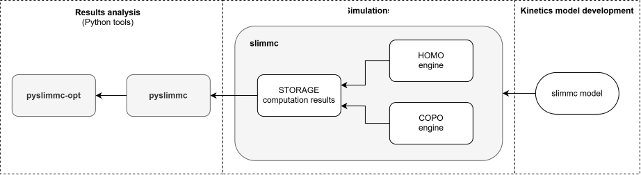

# slimmc documentation

> **Important note — experimental status and AI-assisted development**
>
> slimmc is experimental scientific software, and the project itself is an
> experiment in developing simulation software with extensive AI assistance.
> The current release is provided **“as is”**. **Validation has not been
> carried out**, and results should not be treated as quantitative
> predictions. Validation will proceed against analytical cases, independent
> implementations, other modelling approaches, and published experimental
> literature.
>
> AI-assisted development can produce useful and creative solutions, but also
> code that is difficult to fully reconstruct and independently verify by
> inspection alone. For this reason, **transparency, independent validation,
> and responsibility for scientific claims** are core principles of the project.

The documentation has three entry paths. Start with the one that matches what
you are trying to do; exact references remain available when you need a formal
contract.

Slimmc has no graphical user interface. Simulations are defined in text `.model`
files and run from the command line; results are explored and analysed in
Python through [`pyslimmc`](PYSLIMMC.md). pyslimmc is a regular Python library
and can be used from Python scripts or the standard interpreter, IPython,
Jupyter Notebook/JupyterLab, Marimo, VS Code (including `.py` files and `# %%`
cells), and other environments that run Python.

## I want to run a polymerization

1. [Quick start](QUICKSTART.md) — install, check, run, summarize and plot one model.
2. [Model syntax](MODEL_SYNTAX.md) — shared model-file syntax organized by chemical task.
3. [Simulation results](SIMULATION_RESULTS.md) — what a run, snapshot and stored chain population mean.
4. [pyslimmc guide](PYSLIMMC.md) — analyse runs in Python.
5. [Cookbook](COOKBOOK.md) — short task-oriented recipes.
6. [Scope and limitations](LIMITATIONS.md) — deliberate omissions and numerical caveats.

For terminology, use the [glossary](GLOSSARY.md). For mathematical definitions,
use [theory](THEORY.md).

## I need an exact answer

The `reference/` layer is intended to cover the complete public engine syntax
and public Python API.

- [Command-line interface](reference/CLI.md)
- [Homo engine](reference/HOMO.md)
- [Copo engine](reference/COPO.md)
- [pyslimmc API tree](reference/PYSLIMMC_API_TREE.md) — user-oriented map from `Runs` to `ChainRecord`.
- [pyslimmc API](reference/PYSLIMMC_API.md)
- [pyslimmc callable signatures](reference/PYSLIMMC_SIGNATURES.md)
- [pyslimmc-opt](reference/PYSLIMMC_OPT.md)
- [pyslimmc-opt callable signatures](reference/PYSLIMMC_OPT_SIGNATURES.md)
- [Storage format](reference/STORAGE.md)

The generated signature files are exact inventories of public callable names,
arguments, defaults and return annotations. They complement the human-readable
API references rather than replacing them.

## I want to understand or develop slimmc

- [Core concepts](CONCEPTS.md) — V_kMC, ensembles, pools, distributions and interpretation.
- [Theory](THEORY.md) — equations, kinetic conventions and statistical definitions.
- [Architecture](development/ARCHITECTURE.md)
- [Development workflow](development/DEVELOPMENT.md)
- [Testing and validation](development/TESTING.md)
- [Integration coverage](development/INTEGRATION_COVERAGE.md)
- [Binary releases](development/RELEASES.md)

See also the project [changelog](../CHANGES.md).

## Coding agents and contributors

See [`../AGENTS.md`](../AGENTS.md) for the compact change-safety entry point; canonical details remain in the development and reference documents above.

## See also

- [`QUICKSTART.md`](QUICKSTART.md) — Quick start
- [`MODEL_SYNTAX.md`](MODEL_SYNTAX.md) — Model syntax
- [`PYSLIMMC.md`](PYSLIMMC.md) — pyslimmc guide
